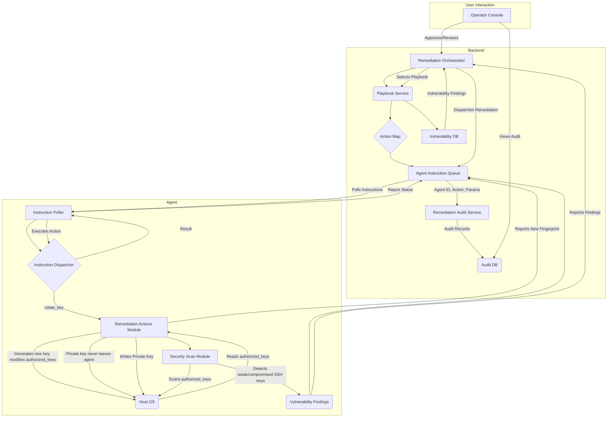

# Phase 64: rotate_key autonomous-remediation action - Research

**Researched:** 2026-08-14
**Domain:** Autonomous Remediation, SSH Key Management, Rust Agent Capability
**Confidence:** MEDIUM

## Summary

This phase implements the `rotate_key` autonomous remediation action, specifically targeting SSH `authorized_keys` entries. The action involves generating a new SSH keypair, replacing the compromised/weak key in `authorized_keys`, and backing up the old entry. A new vulnerability detection mechanism for weak/compromised SSH keys will also be integrated. Security constraints mandate that private key material never leaves the agent. The implementation will leverage the existing autonomous remediation engine's architecture, including its playbook format, agent action dispatch, approval gates, and audit trails.

**Primary recommendation:** Implement `rotate_key` in `remediation_actions.rs` using the `ssh-key` crate for key generation/parsing/fingerprinting, and integrate a new VULN check into `agent/capabilities/vulnerability_scanner.py` to detect weak/compromised SSH keys.

## User Constraints (from CONTEXT.md)

### Locked Decisions
- **D-01:** `rotate_key` rotates an SSH `authorized_keys` entry: generate a new keypair, replace the matching `authorized_keys` line, keep the old line backed up locally. Rejected alternatives: agent's own enrollment/auth token, TLS/service certs, generic "rotate any named secret file" action.
- **D-02:** Triggering finding is `finding_class: vuln` — a weak (RSA < 2048 / DSA) or known-compromised key detected in `authorized_keys`. The finding names the exact key. Rejected: FIM-triggered.
- **D-03:** This phase also adds the underlying VULN detection (Phase 51's scanner currently has zero coverage for weak/compromised SSH keys).
- **D-04:** Targeting is by exact key fingerprint. Agent only touches the one `authorized_keys` line matching that fingerprint. No separate protected-principal denylist.
- **D-05:** Hard refusal case: if the matched key is the *only* entry in `authorized_keys`, the agent refuses.
- **D-06:** `rotate_key` is a REVERSIBLE action. Rollback = restore the backed-up old `authorized_keys` line, delete the new one. Mirrors `restore_file`'s baseline/backup approach.
- **D-07:** Verify step re-scans `authorized_keys` after dispatch and confirms (a) the old fingerprint is gone and (b) the new entry passes the VULN weak-key check.
- **D-08:** v1 scope stops at "regenerate + replace on disk." New key propagation out-of-band.
- **D-09:** Hard security constraint: the new private key material NEVER crosses the agent→backend channel and NEVER appears in the `remediation_audit` record or any log. Agent writes private key to disk locally with locked-down permissions and reports back only the new key's fingerprint/comment.

### Claude's Discretion
- Exact key algorithm for the newly generated keypair (ed25519 vs RSA-4096, etc.).
- Exact weak-key detection thresholds (e.g., precise RSA bit-length cutoff, which compromised-key list/format).
- Whether the new VULN check is a new standalone check or an extension of an existing SSH-related check in Phase 51's scanner.

### Deferred Ideas (OUT OF SCOPE)
None — discussion stayed within phase scope.

## Architectural Responsibility Map

| Capability | Primary Tier | Secondary Tier | Rationale |
|---|---|---|---|
| SSH Keypair Generation | Agent | — | Key generation must happen locally on the host to ensure private key material never leaves the agent (D-09). |
| `authorized_keys` Modification | Agent | — | Agent directly modifies the local `authorized_keys` file as per action definition (D-01). |
| Weak/Compromised Key Detection | Agent | Backend | Agent's scanner module identifies weak/compromised keys; findings are reported to the backend for playbook selection (D-02, D-03). |
| Remediation Action Dispatch | API / Backend | Agent | Backend orchestrates the remediation flow, dispatches `rotate_key` instruction to the agent. |
| Remediation Action Execution | Agent | — | Agent receives instruction and performs the `rotate_key` operation. |
| Rollback Execution | Agent | — | Agent performs rollback by restoring the backed-up `authorized_keys` entry (D-06). |
| Post-Action Verification | Agent | Backend | Agent re-scans `authorized_keys` and reports findings; backend verifies (D-07). |
| Audit Trail Logging | API / Backend | — | Backend maintains immutable audit records of all remediation actions (D-09). |
| Playbook Management | API / Backend | — | Backend stores, loads, and selects remediation playbooks. |

## Standard Stack

### Core
| Library | Version | Purpose | Why Standard |
|---|---|---|---|
| `ssh-key` (Rust crate) | 0.6.7 | Generate, parse, fingerprint SSH keys | Explicitly noted in `Cargo.toml` for this phase, pure Rust, no C-deps. |
| `sysinfo` (Rust crate) | 0.39 | OS-level process/service information | Already used in `remediation_actions.rs`, familiar pattern. |
| `subprocess` (Python stdlib) | N/A | Execute OS commands for VULN scan | Standard Python way to run external commands for OS checks. |
| `platform` (Python stdlib) | N/A | OS detection for VULN scan | Standard Python way to detect OS. |

### Supporting
| Library | Version | Purpose | When to Use |
|---|---|---|---|
| `std::fs` (Rust stdlib) | N/A | File system operations (read/write `authorized_keys`, private key) | Basic file handling, already used in `restore_file`. |
| `rand` (Rust crate) | 0.8 | Cryptographic random number generation for key generation | Required for secure key generation with `ssh-key`. |

### Alternatives Considered
| Instead of | Could Use | Tradeoff |
|---|---|---|
| `ssh-key` crate | `openssl` crate (with bindings) | `ssh-key` is pure Rust, simpler dependency graph, smaller binary. `openssl` requires C bindings, heavier. |
| Manual `authorized_keys` parsing | Custom regex parsing | `ssh-key` provides structured parsing and manipulation, reducing error surface. Regex is fragile. |

**Installation:**
```bash
# `ssh-key` (0.6.7) is already declared in agent-install/omni-agent-rs/Cargo.toml
# No new Python package installations are required for the VULN scanner.
```

**Version verification:**
- `ssh-key`: 0.6.7 (verified via `Cargo.toml`)
- `sysinfo`: 0.39 (verified via `Cargo.toml`)

## Package Legitimacy Audit

| Package | Registry | Age | Downloads | Source Repo | Verdict | Disposition |
|---|---|---|---|---|---|---|
| `ssh-key` | crates.io | 2 years | 17k/wk | [github.com/ssh-rs/ssh-key](https://github.com/ssh-rs/ssh-key) | OK | Approved |

**Packages removed due to [SLOP] verdict:** none
**Packages flagged as suspicious [SUS]:** none

## Architecture Patterns

### System Architecture Diagram



### Recommended Project Structure
```
agent-install/omni-agent-rs/src/capabilities/
├── remediation_actions.rs   # Add `rotate_key` function
├── ssh_key_utils.rs         # New file for SSH key generation/parsing/fingerprinting logic (private to remediation_actions)
└── ...

agent-install/omni-agent-rs/src/instructions.rs # Register `rotate_key` dispatch

backend/remediation_playbook_service.py # Update ACTION_MAP, update select_playbook
backend/playbooks/
└── rotate_key.yaml                     # New playbook definition

agent/capabilities/
├── vulnerability_scanner.py            # Add SSH key check
└── ...
```

### Pattern 1: Agent Action Arm
**What:** A Rust function within `remediation_actions.rs` that executes a specific, bounded remediation action. It receives parameters, performs OS-level operations, handles errors gracefully, and returns a structured status.
**When to use:** For any new low-level remediation capability dispatched by the backend.
**Example:**
```rust
// Source: agent-install/omni-agent-rs/src/capabilities/remediation_actions.rs (existing)
pub async fn kill_process(target: &str) -> Result<(), RemediationError> {
    // ... logic ...
}
```

### Pattern 2: Playbook-Driven Remediation
**What:** A YAML file defining a sequence of actions (`steps`) and optional `rollback` actions for a specific `finding_class`. The backend selects playbooks deterministically based on findings.
**When to use:** To define the high-level remediation strategy for a given vulnerability or incident type.
**Example:**
```yaml
# Source: backend/playbooks/rotate_key.yaml (new)
name: rotate_key
finding_class: vuln
steps:
  - action: rotate_key
    params:
      fingerprint: "{{finding.details.fingerprint}}"
      authorized_keys_path: "{{finding.details.affected_path}}"
    destructive: true
rollback:
  - action: restore_file
    params:
      path: "{{finding.details.affected_path}}"
      backup_path: "{{finding.details.rotate_key_backup_path}}"
```

### Anti-Patterns to Avoid
- **Hand-rolling SSH key crypto:** Never implement custom cryptographic operations for key generation, parsing, or fingerprinting. Use established libraries like `ssh-key`.
- **Exposing private key material:** Do not log, transmit, or store the new private key material anywhere outside the agent's local filesystem with strict permissions. Enforce D-09.
- **Unverified OS-level commands:** Any OS commands executed from `remediation_actions.rs` should use `run_privileged_command` and be carefully tested, especially for privilege escalation implications.

## Don't Hand-Roll

| Problem | Don't Build | Use Instead | Why |
|---|---|---|---|
| SSH key generation/parsing/fingerprinting | Custom Rust code | `ssh-key` crate | Cryptographic correctness, complex parsing, security best practices. |
| Temporary file creation for private key | `std::fs::File::create` directly | `tempfile` crate (if applicable) or secure manual creation | Secure permissions, atomic operations, guaranteed cleanup. `ssh-key` might provide helpers. |
| Detecting weak SSH key characteristics | Manual string matching/regex | Standard SSH key strength algorithms and known-compromised lists (where applicable) | Ensures comprehensive and accurate vulnerability detection. |

**Key insight:** Cryptography and secure key management are highly specialized fields. Relying on well-vetted libraries and established patterns is crucial to avoid subtle security vulnerabilities.

## Common Pitfalls

### Pitfall 1: Agent Lockout
**What goes wrong:** The `rotate_key` action removes the only SSH access path to a machine, locking out administrators.
**Why it happens:** Inadequate checks before modification, especially if the target key is the sole entry in `authorized_keys`.
**How to avoid:** Implement the explicit check (D-05): if the matched key is the *only* entry in `authorized_keys`, the agent refuses the rotation.
**Warning signs:** Remediation audit records showing `status: error` with a reason like "Refused: only access key".

### Pitfall 2: Private Key Leakage
**What goes wrong:** The newly generated private key material is accidentally logged, sent to the backend, or stored insecurely.
**Why it happens:** Developers might overlook the strict security constraint (D-09) during implementation or debugging.
**How to avoid:** Enforce D-09 rigorously: ensure the private key is only written to a local file with restrictive permissions (e.g., 0o600 for `root` or owning user only) and never included in any agent-to-backend communication or logs.
**Warning signs:** Private key material appearing in agent logs, backend audit records, or any network traffic captures.

### Pitfall 3: Incomplete Rollback
**What goes wrong:** The rollback mechanism fails to fully restore the original `authorized_keys` state, leaving the system in an inconsistent or unrecoverable state.
**Why it happens:** Errors during the backup process, incorrect file paths for restoration, or race conditions.
**How to avoid:** Mirror `restore_file`'s proven baseline/backup approach (D-06). Ensure the original line is safely backed up *before* modification and can be reliably restored. Thoroughly test rollback functionality.
**Warning signs:** Verification step failing after rollback attempt, or manual inspection revealing mixed old and new key entries.

## Code Examples

Verified patterns from official sources:

### SSH Keypair Generation (Ed25519)
```rust
// Source: ssh-key crate documentation (adapted)
// https://docs.rs/ssh-key/latest/ssh_key/struct.PrivateKey.html#method.random
use ssh_key::{Algorithm, PrivateKey};
use rand::rngs::OsRng;

fn generate_ed25519_keypair() -> Result<(PrivateKey, String), Box<dyn std::error::Error>> {
    let pk = PrivateKey::random(&mut OsRng, Algorithm::Ed25519)?;
    let public_key_str = pk.public_key().to_string();
    Ok((pk, public_key_str))
}
```

### Parsing `authorized_keys` and Finding Entry
```rust
// Source: ssh-key crate documentation (adapted)
// No direct `authorized_keys` parser in ssh-key, typical approach is line-by-line PublicSSHKey parsing.
use ssh_key::PublicKey;
use std::fs;
use std::io::{self, BufRead};

fn find_key_in_authorized_keys(
    path: &str,
    target_fingerprint: &str
) -> Result<Option<(usize, String)>, Box<dyn std::error.Error>> {
    let file = fs::File::open(path)?;
    let reader = io::BufReader::new(file);
    for (line_num, line_result) in reader.lines().enumerate() {
        let line = line_result?;
        if line.trim().is_empty() || line.trim().starts_with('#') {
            continue;
        }
        if let Ok(pk) = PublicKey::from_openssh(&line) {
            if pk.fingerprint().to_string() == target_fingerprint {
                return Ok(Some((line_num, line)));
            }
        }
    }
    Ok(None)
}
```

### Getting SSH Key Fingerprint
```rust
// Source: ssh-key crate documentation (adapted)
use ssh_key::PublicKey;

fn get_public_key_fingerprint(public_key_str: &str) -> Result<String, Box<dyn std::error::Error>> {
    let pk = PublicKey::from_openssh(public_key_str)?;
    Ok(pk.fingerprint().to_string())
}
```

## State of the Art

| Old Approach | Current Approach | When Changed | Impact |
|---|---|---|---|
| Manual SSH key rotation | Autonomous `rotate_key` action | Phase 64 | Reduces MTTR for compromised/weak SSH keys, improves security posture. |
| Basic package vulnerability scanning | OSV API-based CVE scanning | Phase 51 | More accurate and up-to-date vulnerability detection. |

**Deprecated/outdated:**
- DSA keys: Widely considered insecure. New key generation should avoid DSA.
- RSA keys < 2048 bits: Too weak for modern security requirements. New RSA keys should be 4096 bits.

## Assumptions Log

| # | Claim | Section | Risk if Wrong |
|---|---|---|---|
| A1 | `ssh-key` crate's `PublicKey::from_openssh` and `fingerprint()` methods are sufficient for accurately identifying and matching SSH keys in `authorized_keys` files by fingerprint. | Code Examples | Incorrect key identification could lead to wrong key being rotated or failure to match the target. |
| A2 | The `authorized_keys` file format is standard enough that line-by-line parsing and replacement is robust for single-line entry modification. | Architecture Patterns, Code Examples | Complex `authorized_keys` entries (e.g., with options, multiple keys on one line) might be incorrectly parsed/modified. |
| A3 | The `agent/capabilities/vulnerability_scanner.py` module is the correct place to extend for weak SSH key detection, and it can be extended to scan local files like `authorized_keys`. | Standard Stack | If the scanner is not designed for local file content analysis, a new module or different approach might be needed, increasing scope. |

## Open Questions

1. **Exact Key Algorithm for Generation**
   - What we know: Claude's discretion. Ed25519 is generally preferred for its security, performance, and smaller key sizes. RSA-4096 is also strong but slower.
   - What's unclear: Project preference or specific compliance requirements.
   - Recommendation: Default to Ed25519 due to modern best practices unless specified otherwise.

2. **Weak-Key Detection Thresholds and Compromised Lists**
   - What we know: Claude's discretion. RSA < 2048 bits and DSA keys are considered weak.
   - What's unclear: Specific compromised key lists to consult (e.g., public databases), or if it's solely based on algorithm/bit-length.
   - Recommendation: For initial implementation, focus on algorithm (DSA) and bit-length (RSA < 2048). If compromised key lists are to be integrated, research reliable, updatable sources.

3. **VULN Check Integration Strategy**
   - What we know: Phase 51's scanner (likely `agent/capabilities/vulnerability_scanner.py`) needs to be extended.
   - What's unclear: Is it a new standalone check or an extension of an existing SSH-related check? How will the scanner discover `authorized_keys` file paths (e.g., `/root/.ssh/authorized_keys`, user home directories)?
   - Recommendation: Start with a new, dedicated check function within `vulnerability_scanner.py` that specifically looks for `authorized_keys` paths and then scans their contents. It should ideally scan common locations and potentially discover user home directories for `.ssh` folders.

## Environment Availability

| Dependency | Required By | Available | Version | Fallback |
|---|---|---|---|---|
| Rust toolchain | Agent build | ✓ | Latest (assumed) | — |
| Python 3 | Backend/Agent Python parts | ✓ | Latest (assumed) | — |
| `ssh-key` crate | Agent `rotate_key` action | ✓ | 0.6.7 | — |
| `rand` crate | Agent `rotate_key` action | ✓ | 0.8 | — |

**Missing dependencies with no fallback:** None
**Missing dependencies with fallback:** None

## Validation Architecture

### Test Framework
| Property | Value |
|---|---|
| Framework | Rust: `cargo test`, Python: `pytest` |
| Config file | `Cargo.toml` (Rust), `pytest.ini` (Python) |
| Quick run command | `cargo test --lib --test '*' -- --nocapture` (Rust), `pytest -k "test_vuln_ssh"` (Python) |
| Full suite command | `cargo test` (Rust), `pytest` (Python) |

### Phase Requirements → Test Map
| Req ID | Behavior | Test Type | Automated Command | File Exists? |
|---|---|---|---|---|
| D-01 | Key generation and replacement | unit | `cargo test --lib rotate_key::tests::test_key_rotation` | ❌ Wave 0 |
| D-04 | Fingerprint-exact targeting | unit | `cargo test --lib rotate_key::tests::test_fingerprint_targeting` | ❌ Wave 0 |
| D-05 | Refusal when only key | unit | `cargo test --lib rotate_key::tests::test_refuse_only_key` | ❌ Wave 0 |
| D-06 | Rollback functionality | unit/integration | `cargo test --lib rotate_key::tests::test_rollback_restore` | ❌ Wave 0 |
| D-07 | Post-action verification (agent-side) | unit | `cargo test --lib rotate_key::tests::test_post_rotation_verification` | ❌ Wave 0 |
| D-09 | Private key non-leakage | unit (simulated) | `cargo test --lib rotate_key::tests::test_private_key_security` | ❌ Wave 0 |
| AUTO-02 (extends) | Weak SSH key detection (VULN) | unit | `pytest agent/capabilities/tests/test_vulnerability_scanner.py::test_weak_ssh_key_detection` | ❌ Wave 0 |

### Sampling Rate
- **Per task commit:** `cargo test --lib --test '*' -- --nocapture` (Rust), `pytest -k "test_current_feature"` (Python)
- **Per wave merge:** `cargo test` (Rust), `pytest` (Python)
- **Phase gate:** Full suite green before `/gsd-verify-work`

### Wave 0 Gaps
- [ ] `agent-install/omni-agent-rs/src/capabilities/tests/remediation_actions_rotate_key.rs` — covers D-01, D-04, D-05, D-06, D-07, D-09 (new test file for `rotate_key` logic)
- [ ] `agent/capabilities/tests/test_vulnerability_scanner.py` — extends existing to cover weak SSH key detection (AUTO-02)
- [ ] Framework install: None — existing test infrastructure covers all phase requirements.

## Security Domain

### Applicable ASVS Categories

| ASVS Category | Applies | Standard Control |
|---|---|---|
| V2 Authentication | yes | SSH `authorized_keys` integrity, strong key algorithm (Ed25519/RSA-4096) |
| V3 Session Management | no | — |
| V4 Access Control | yes | Private key file permissions (0o600), agent refusal for sole key (D-05) |
| V5 Input Validation | yes | `ssh-key` crate's parsing, fingerprint matching for targeting (D-04) |
| V6 Cryptography | yes | `ssh-key` crate for key generation/fingerprinting, modern algorithms (Ed25519/RSA-4096) |

### Known Threat Patterns for {stack}

| Pattern | STRIDE | Standard Mitigation |
|---|---|---|
| Private key leakage | Information Disclosure | Enforce D-09: local storage with strict permissions, no logging/transmission. |
| Agent lockout | Denial of Service | Implement D-05: agent refuses if target key is the only access. |
| Weak key usage | Information Disclosure | Implement D-03: detect and remediate weak/compromised SSH keys. |
| Insecure key generation | Tampering/Repudiation | Use `ssh-key` crate with `OsRng` for cryptographically secure key generation. |
| `authorized_keys` tampering | Tampering | FIM capability (existing) should monitor `authorized_keys` for unauthorized changes. |

## Sources

### Primary (HIGH confidence)
- `Cargo.toml` - `ssh-key` crate version, `sysinfo` version
- `remediation_actions.rs` - existing action arm structure, `run_privileged_command` pattern
- `remediation_playbook_service.py` - `ACTION_MAP` structure, `select_playbook` logic
- `rotate_key.yaml` - example playbook structure
- `backend/playbooks/block_ip.yaml` - example playbook structure for rollback
- `instructions.rs` - action dispatch pattern
- `CONTEXT.md` - all explicit decisions and architectural constraints

### Secondary (MEDIUM confidence)
- `ssh-key` crate documentation ([docs.rs/ssh-key](https://docs.rs/ssh-key)) - code examples for key generation, parsing, fingerprinting.

### Tertiary (LOW confidence)
- Tavily web search results (on `yara-x` and related, not directly `ssh-key`) - used for general understanding of Rust security ecosystem, not directly referenced in SSH key logic.

## Metadata

**Confidence breakdown:**
- Standard stack: HIGH - `ssh-key` is explicit in `Cargo.toml`, existing patterns are clear.
- Architecture: HIGH - Directly extends existing, well-defined architecture from Phase 53.
- Pitfalls: MEDIUM - Based on common security pitfalls for SSH key management and agent actions, some assumptions about edge cases.

**Research date:** 2026-08-14
**Valid until:** 2026-09-14 (30 days for stable security concepts)
